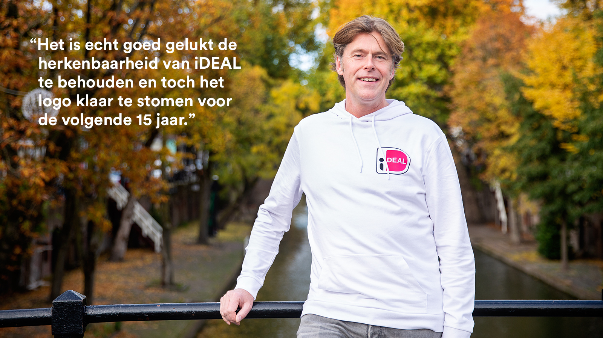
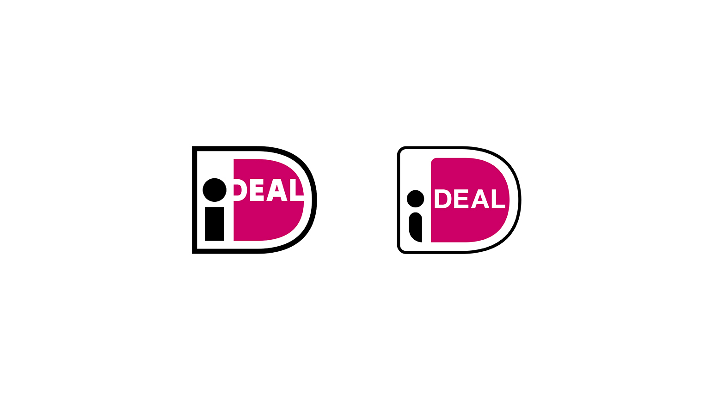
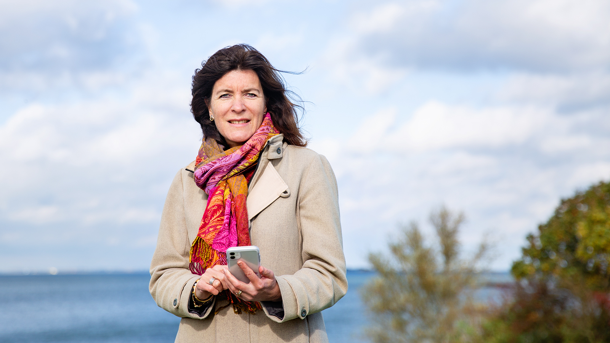

# Een nieuwe merkstrategie en een gerestyled logo voor één van de grootste merken van Nederland, iDEAL!

## Welke nieuwe diensten passen goed bij de toekomstvisie van iDEAL? Hoe hangen de verschillende diensten samen? 

iDEAL heeft een indrukwekkend CV. Het merk werd 15 jaar geleden geïntroduceerd en groeide jaar na jaar stevig door. Ondertussen is iDEAL
onbetwist marktleider op het gebied van online betalingen, met zo’n 865 miljoen transacties per jaar, ter waarde van ruwweg 70 miljard euro.
Bovendien is iDEAL volgens Emerce ook al jaren het best gewaardeerde online betaalmiddel [i]. Ook staat iDEAL op de vierde plaats van de lijst met beste zakelijke dienstverleners van 2019 in de MT top 1000 [ii]. Een eer om met zo’n groot en mooi merk aan de slag te mogen! 

We kennen iDEAL als online betaaloptie naast bijvoorbeeld overmaken en de creditcard. In de afgelopen jaren zijn er nieuwe diensten ontwikkeld, zoals recentelijk ‘iDEAL Inplannen’ waarbij de consument zelf de betaaldatum kan bepalen. En daar stopt het natuurlijk niet bij, want de concurrent ligt op de loer. Het tempo van internationalisatie en technologische ontwikkelingen is hoog.  

Dan komt onherroepelijk de vraag: Welke nieuwe diensten passen goed bij de toekomstvisie van iDEAL, en hoe hangen die verschillende diensten samen?  

**Rob Hoitink, Senior Product Owner iDEAL**: “Er is veel werk gedaan aan het merk en we kijken voortdurend naar welke nieuwe diensten en aanpassingen het merk wel of niet kunnen versterken.”

**Loes Romeijnders, Communicatie-Adviseur iDEAL**: “Met zoveel verschillende belanghebbenden, is er veel discussie geweest tussen alle betrokken partijen, waaronder alle banken. Iedereen heeft een mening over het merk en de uitstraling. Uiteindelijk gaat het er echter om wat belangrijk is voor de gebruiker. Ik wilde daarom een kapstok waaruit duidelijk bij aanvang blijkt: dit kan wel en dit kan niet.”

Branddoctors is door iDEAL gevraagd om te helpen bij een merkstrategie die ruimte biedt voor innovatieve diensten (extensies) onder het bestaande merk. En om de visuele identiteit van iDEAL subtiel aan te passen zodat deze mee gaat met de tijd. Voor de buitenwereld moet zichtbaar zijn dat iDEAL in ontwikkeling is, wat de positie van iDEAL in de online betaalmarkt verder moet verstevigen. 

## Het resultaat: Een nieuwe merkstrategie en een gerestyled logo 

Aan de slag! We hielden interviews met interne en externe stakeholders over de merken, de strategie en innovaties. We toetsten logo’s, namen en extensies uitgebreid bij de consument. In een serie van workshops en zogeheten “kitchen reviews” namen we de belangrijke beslissingen samen met het iDEAL–team.

Dat leidde tot een aangepaste merkstrategie met een duidelijk toetsingskader voor nieuwe innovaties. Het leidde ook tot een gerestyled logo waarbij ook is nagedacht is over de visuele vormgeving van de extensies.

*Oude versus nieuwe iDeal logo*

**Rob**: “iDEAL was zeer gebaat bij Branddoctors. We hebben in het merk een grotere stap kunnen zetten. Hoe denken we over ons merk? Hoe gaan we in de toekomst met nieuwe ontwikkelingen om? We hebben een helder merkkader en we hebben een tof gerestyled logo voor alle mooie extensies! Een tastbaar resultaat.”

**Loes**: “Ik ben blij dat we een fris gerestyled logo hebben, wat van deze tijd is en past bij de uitstraling van iDEAL. Want ook al bestaat iDEAL reeds 15 jaar, het is nog steeds heel vernieuwend, zeker als je kijkt naar de rest van Europa.”

## De grootste uitdaging? Voldoende te vernieuwen, terwijl je toch herkenbaar en betrouwbaar blijft.  

**Loes**: “De kracht van het merk en het feit dat iDEAL een betaalmiddel is, maakt werken aan het iDEAL-merk een tandje serieuzer. Aanpassingen mogen het vertrouwen in het merk niet aantasten.”

**Rob**: “Toen we samen de eisen en wensen hadden opgesteld voor het nieuwe logo, was ik benieuwd wat daarbinnen mogelijk was. Ik vond het mooi om te zien dat er zoveel mogelijk was. Het is echt goed gelukt de herkenbaarheid van iDEAL te behouden en toch het logo klaar te stomen voor de volgende 15 jaar.”

## Wij kunnen leren van de consument, nog steeds. 

**Rob**: “Wij zijn een organisatie die bestaat uit betaalspecialisten met een sterke mening. Toch willen we leren van de consument. Daarmee wordt het product en de propositie beter. Door de externe toetsing leerden we dat de naam van één van onze nieuwe diensten niet duidelijk was. Anders waren we live gegaan met een naam die niemand echt goed zou begrijpen.”

## Een externe partij krijgt de discussie op gang  

**Loes**: “Het is fijn dat een externe partij dit doet. Dan komt er een openhartige discussie op gang. Iedereen krijgt de ruimte zijn of haar mening te geven of een vraag te stellen. Als je het intern houdt, is dat moeilijker. Wanneer er gevoeligheden waren, heeft Branddoctors die boven tafel gebracht.”

**Rob**: “Het was een hele prettige samenwerking, omdat jullie de expertise brachten die we nodig hadden. Dat gebeurde zorgvuldig en transparant. Het is fijn als je begeleid wordt in het maken van keuzes. We brachten zelf de kennis van ons merk in en jullie goten dat in een werkbaar merkkader. Het is waardevol goed te begrijpen hoe flexibel het merk is en wat er wel en niet bij past.”

## En nu? We vieren onze 15e jarige verjaardag met een mooi gerestyled logo!

**Rob**: “27 oktober 2020 hebben we met een online evenement onze 15e verjaardag gevierd. Daar hebben we tevens het nieuwe logo gepresenteerd. We hebben een helder merkkader en merkportfolio voor de toekomst.We komen binnenkort met nieuwe extensies onder het merk iDEAL. We zijn goed voorbereid voor de volgende 15 jaar!”

---

Interview met Rob Hoitink, Senior Product Owner iDEAL en Loes Romeijnders, Communicatie-Adviseur iDEAL.

## Meer weten?

Maak een afspraak met Claire via claire@branddoctors.com of via Ellen: 030-6026000.

[i]: https://www.emerce.nl/nieuws/emerce-100-beste-bedrijven-ebusiness-2020
[ii]: https://www.mt.nl/mt1000/mt1000_2019/mt1000-dit-zijn-de-beste-zakelijke-dienstverleners-van-2019/579113

https://www.branddoctors.com/case/ideal/
