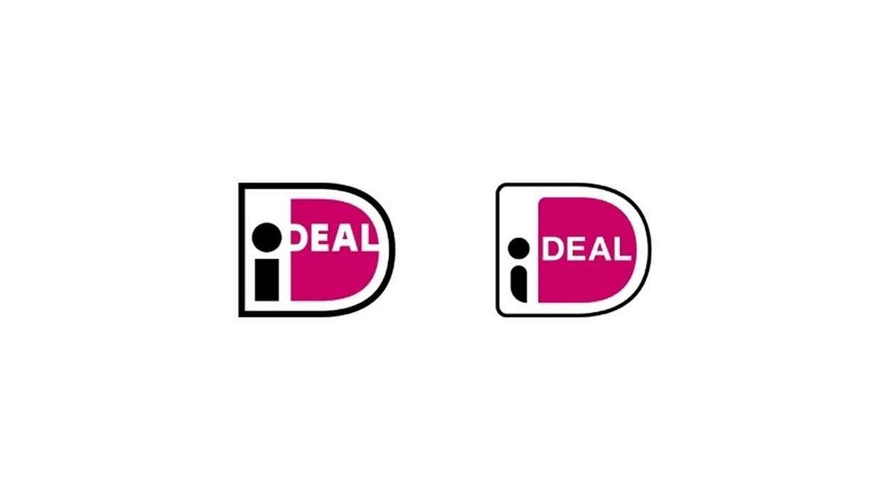

# Nieuwe logo iDeal door Branddoctors

Het misschien wel meest geziene logo van Nederland heeft na vijftien jaar dienst te hebben gedaan een rebrand ondergaan door Branddoctors.

iDeal is met zo’n 865 miljoen transacties per jaar een van de meest geziene logo’s van Nederland. Branddoctors werd gevraagd de merkstrategie te vernieuwen en het logo na vijftien jaar op te frissen.

In de afgelopen jaren heeft iDeal nieuwe diensten ontwikkeld, zoals bijvoorbeeld iDeal Inplannen, waarbij de consument zelf de betaaldatum kan bepalen. Rob Hoitink, Senior Product Owner iDeal: ‘En daar stopt het natuurlijk niet bij, want de concurrent ligt op de loer. Dus dan rijzen onherroepelijk vragen: Welke nieuwe diensten passen goed bij de toekomstvisie van iDeal en hoe hangen de verschillende diensten samen? Een nieuw logo is een goede manier om de nieuwe ontwikkelingen te ondersteunen. Branddoctors heeft ons geholpen om een merkstrategie te ontwikkelen die ruimte biedt voor innovatieve diensten/extensies) onder het bestaande merk om met nieuwe betaaloplossingen de positie van iDeal in de online betaalmarkt verder te verstevigen.’

## Nieuwe logo iDeal: Nog steeds vertrouwd, maar frisser en vriendelijker

Claire de Nerée tot Babberich, partner en strateeg bij Branddoctors: ‘Vertrouwen is het grootste goed in de financiële wereld. De kaders die iDeal stelde waren uitdagend. Om geen afbreuk te doen aan de bestaande associaties met het merk - vertrouwd, veilig, zekerheid, gemak, direct en snel - moesten de D-vorm, de kleuren en typografie hetzelfde blijven en de i herkenbaar. Het nieuwe logo oogt frisser en vriendelijker door subtielere lijnen en vlakken. Het meest in het oog springend is de “i”, die wat persoonlijker is en mooi aansluit op “Deal”. Consumenten lezen er nu ook meer het concept in: iDeal = ik maak een deal. De logofamilie is op diezelfde manier onder handen genomen.’

https://www.marketingtribune.nl/design/nieuws/2020/10/nieuwe-logo-ideal-door-branddoctors/index.xml
